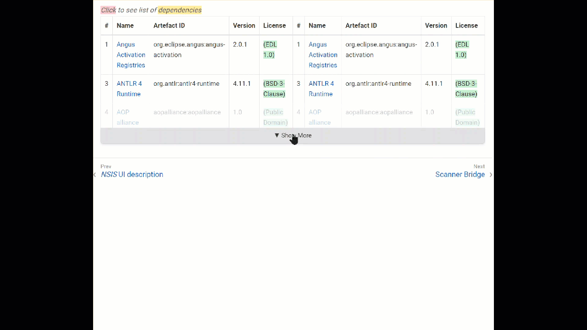

# Collapsible Tables

This Antora UI extension has been created by Frank Milde and posted on the [Antora Zilup Tips Channel](  https://antora.zulipchat.com/#narrow/channel/282405-tips-.F0.9F.92.A1/topic/Collapsible.20tables).

The extension allows to add a custom role to a table and make it collapsible, see the gif.



**IMPORTANT**

The class attribute (role) `.collapsible` must be the first argument. If `cols=...` is first, you still get the collapsible functionality, but no other styling of the table.

## Usage

```asciidoc 
[.collapsible, cols="1,4,8"]
|===
...
|===
```

## Setup

1. Integrate collapsible-table to your UI:\
File: `collapsible-table.css` --> `src/css/`\
File: `collapsible-table.js` --> `src/js/vendor`\
Add: `@import url("collapsible-table.css");` --> `src/css/site.css`\
Add: `<script async src="{{{uiRootPath}}}/js/vendor/collapsible-table.js"></script>` --> `src/partials/footer-scripts.hbs`
